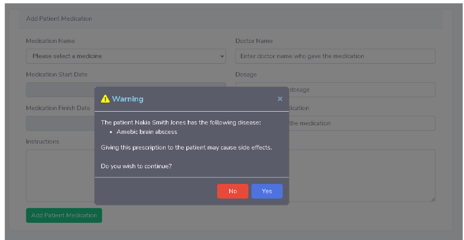

# MedicalRecords

## Description
The first part of my thesis was to create a web application for the doctors to gather information about their patients. 
Information like illnesses that may had or have, surgeries, medicines that are taking or took, etc. 

 

The second part was to create human models (female, male) to display those illnesses and surgeries to the models.
I had 4 human models for each gender. The first one was showing the skeleton of a human body, the second one was showing the organs, the third one was showing the nerves of the body
and the fourth one was the full body.

 

When a patient had a problem, lets say he had a knee surgery, when the doctor wanted to see the human model the knee of the model was red with an info button that was descriping what
happend to the patient.
Doctors had the ability to prescribe medicines to the patients, but i had a validation to check what medicines does the patient currently taking and if they have side effects with the current
medicine that the doctor want's to give to them.

## Technologies
- Unity 
- Laravel

## Project images

### Website

### Unity

